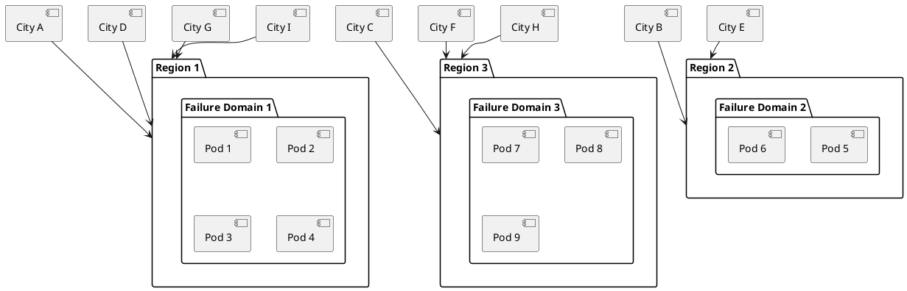

```plantuml
@startuml
package "Region 1" {
  package "Failure Domain 1" {
    [Pod 1]
    [Pod 2]
    [Pod 3]
    [Pod 4]
  }
}

package "Region 2" {
  package "Failure Domain 2" {
    [Pod 5]
    [Pod 6]
  }
}

package "Region 3" {
  package "Failure Domain 3" {
    [Pod 7]
    [Pod 8]
    [Pod 9]
  }
}

[City A] --> [Region 1]
[City B] --> [Region 2]
[City C] --> [Region 3]
[City D] --> [Region 1]
[City E] --> [Region 2]
[City F] --> [Region 3]
[City G] --> [Region 1]
[City H] --> [Region 3]
[City I] --> [Region 1]
@enduml
```
