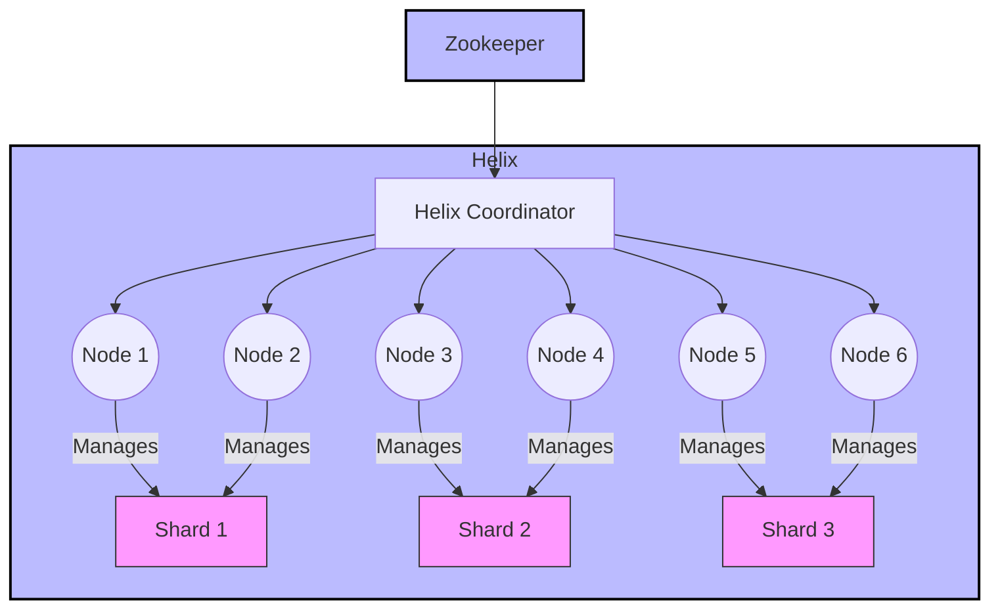

```mermaid
graph TD
    subgraph Helix
        Coordinator[Helix Coordinator] --> Node1((Node 1))
        Coordinator --> Node2((Node 2))
        Coordinator --> Node3((Node 3))
        Coordinator --> Node4((Node 4))
        Coordinator --> Node5((Node 5))
        Coordinator --> Node6((Node 6))
        
        Node1 -- Manages --> Shard1[Shard 1]
        Node2 -- Manages --> Shard1[Shard 1]
        Node3 -- Manages --> Shard2[Shard 2]
        Node4 -- Manages --> Shard2[Shard 2]
        Node5 -- Manages --> Shard3[Shard 3]
        Node6 -- Manages --> Shard3[Shard 3]
    end
    
    
    Zookeeper[Zookeeper]
    
    
    Zookeeper --> Coordinator
    
    style Helix fill:#BBF,stroke:#000,stroke-width:2px
    style Zookeeper fill:#BBF,stroke:#000,stroke-width:2px
    style Shard1 fill:#F9F,stroke:#333,stroke-width:1px
    style Shard2 fill:#F9F,stroke:#333,stroke-width:1px
    style Shard3 fill:#F9F,stroke:#333,stroke-width:1px


```
