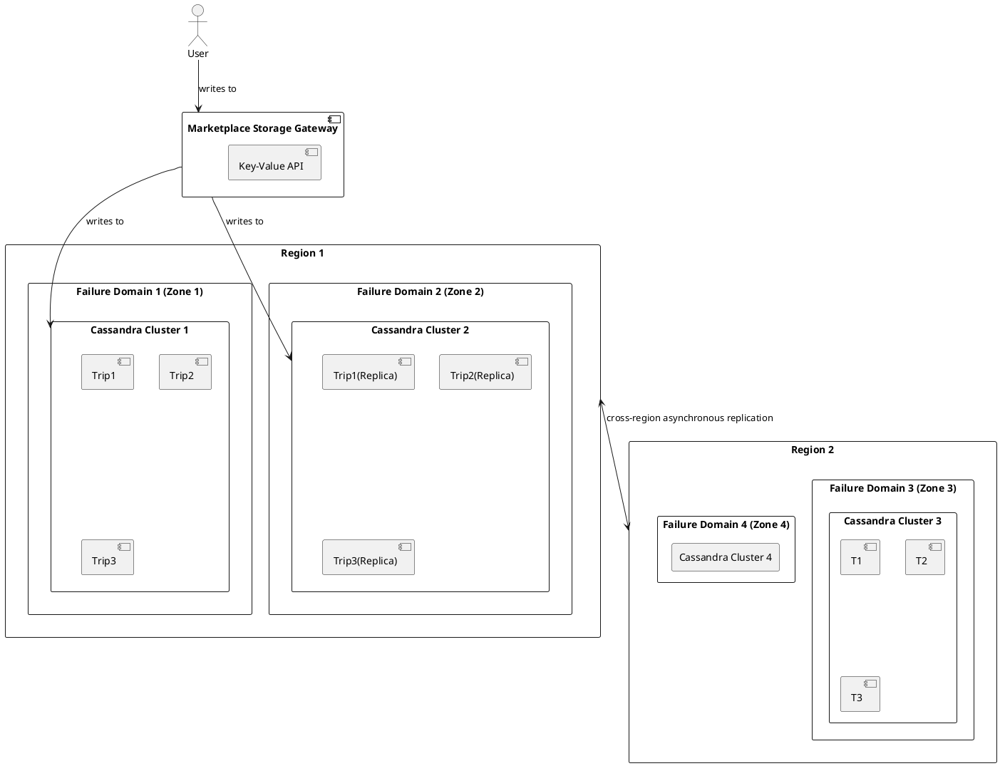

```plantuml
@startuml
!define RECTANGLE component

rectangle "Region 1" {
  rectangle "Failure Domain 1 (Zone 1)" {
    rectangle "Cassandra Cluster 1" {
      [Trip1]
      [Trip2]
      [Trip3]
    }
  }
  rectangle "Failure Domain 2 (Zone 2)" {
    rectangle "Cassandra Cluster 2" {
      [Trip1(Replica)]
      [Trip2(Replica)]
      [Trip3(Replica)]
    }
  }
}

rectangle "Region 2" {
  rectangle "Failure Domain 3 (Zone 3)" {
    rectangle "Cassandra Cluster 3" {
      [T1]
      [T2]
      [T3]
    }
  }
  rectangle "Failure Domain 4 (Zone 4)" {
    rectangle "Cassandra Cluster 4" {
    }
  }
}

component "Marketplace Storage Gateway" as MSG {
  [Key-Value API]
}

actor User

User --> MSG : writes to 
MSG --> "Cassandra Cluster 1" : writes to
MSG --> "Cassandra Cluster 2" : writes to
"Region 1" <--> "Region 2" : cross-region asynchronous replication


@enduml


```
