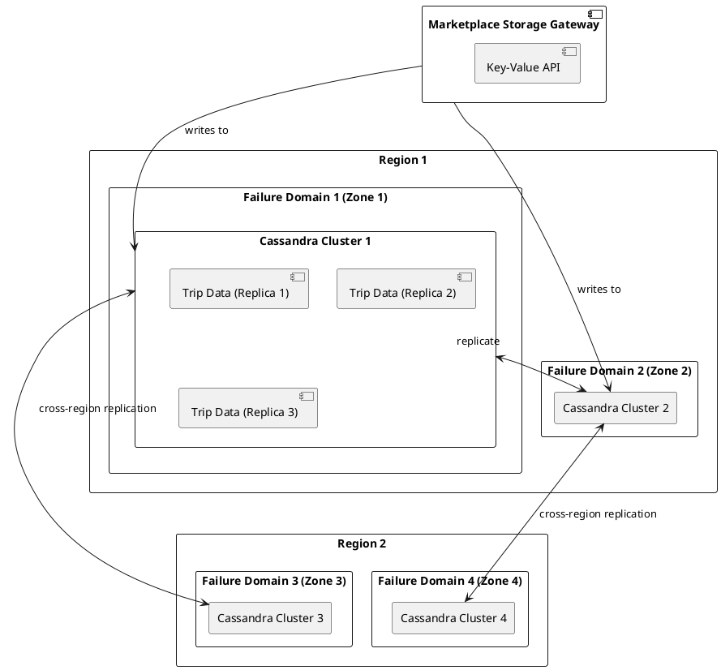

```plantuml
@startuml
!define RECTANGLE component

rectangle "Region 1" {
  rectangle "Failure Domain 1 (Zone 1)" {
    rectangle "Cassandra Cluster 1" {
      [Trip Data (Replica 1)]
      [Trip Data (Replica 2)]
      [Trip Data (Replica 3)]
    }
  }
  rectangle "Failure Domain 2 (Zone 2)" {
    rectangle "Cassandra Cluster 2" {
      [Trip Data (Replica 1)]
      [Trip Data (Replica 2)]
      [Trip Data (Replica 3)]
    }
  }
}

rectangle "Region 2" {
  rectangle "Failure Domain 3 (Zone 3)" {
    rectangle "Cassandra Cluster 3" {
      [Trip Data (Replica 1)]
      [Trip Data (Replica 2)]
      [Trip Data (Replica 3)]
    }
  }
  rectangle "Failure Domain 4 (Zone 4)" {
    rectangle "Cassandra Cluster 4" {
      [Trip Data (Replica 1)]
      [Trip Data (Replica 2)]
      [Trip Data (Replica 3)]
    }
  }
}

component "Marketplace Storage Gateway" as MSG {
  [Key-Value API]
}

MSG --> "Cassandra Cluster 1" : writes to
MSG --> "Cassandra Cluster 2" : writes to
"Cassandra Cluster 1" <--> "Cassandra Cluster 2" : replicate
"Cassandra Cluster 1" <--> "Cassandra Cluster 3" : cross-region replication
"Cassandra Cluster 2" <--> "Cassandra Cluster 4" : cross-region replication

@enduml

```
