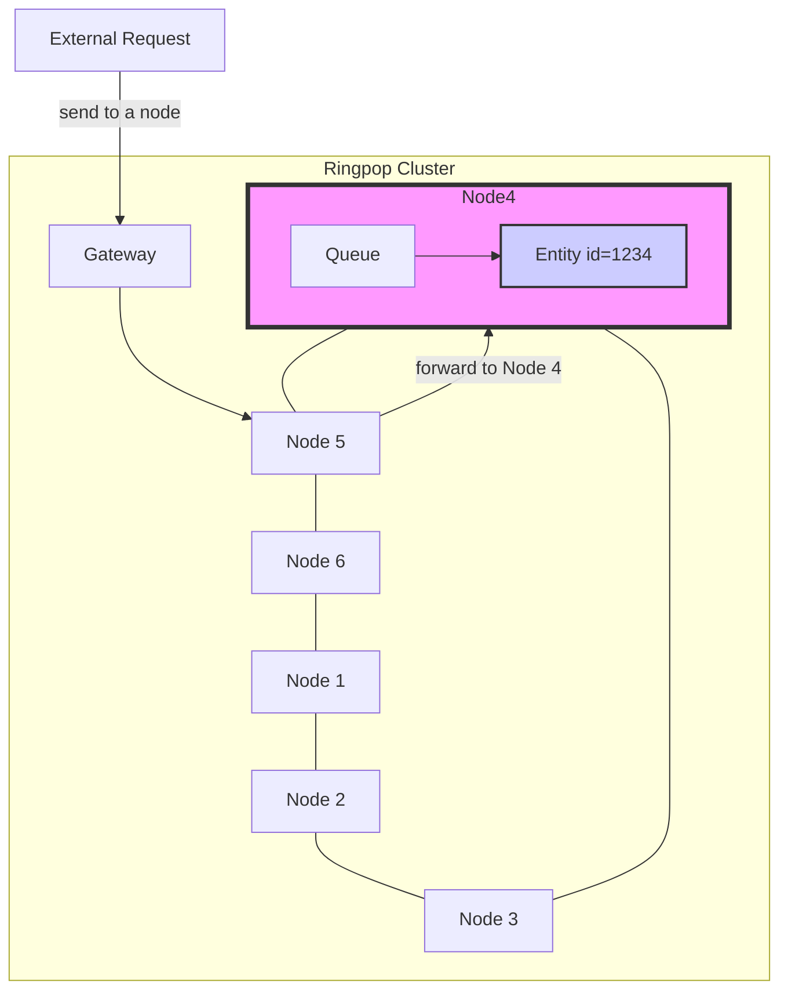

```mermaid
graph TD
    subgraph Ringpop Cluster
        Node1[Node 1] --- Node2[Node 2]
        Node2[Node 2] --- Node3[Node 3]
        Node3[Node 3] --- Node4[Node 4]
        Node4[Node 4] --- Node5[Node 5]
        Node5[Node 5] --- Node6[Node 6]
        Node6[Node 6] --- Node1[Node 1]
        Gateway
    end
    

    subgraph Node4
        Queue[Queue] --> Entity1234["Entity id=1234"]
    end

    extRequest["External Request"] --> |send to a node| Gateway
    Gateway --> Node5
    Node5 --> |forward to Node 4| Node4

    style Node4 fill:#f9f,stroke:#333,stroke-width:4px
    style Entity1234 fill:#ccf,stroke:#333,stroke-width:2px

```
