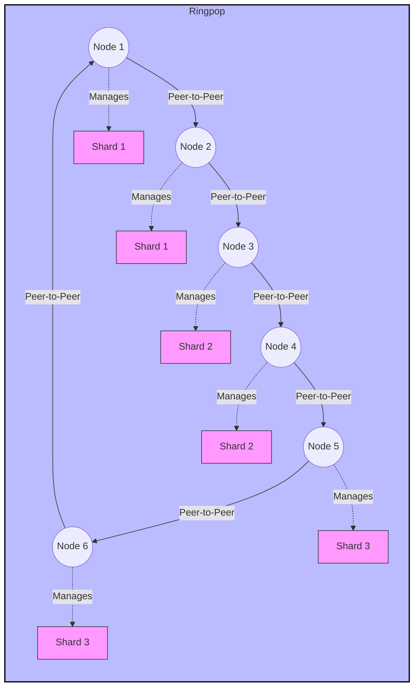

```mermaid
graph LR
    subgraph Ringpop
        Node1((Node 1)) -->|Peer-to-Peer| Node2((Node 2))
        Node2 -->|Peer-to-Peer| Node3((Node 3))
        Node3 -->|Peer-to-Peer| Node4((Node 4))
        Node4 -->|Peer-to-Peer| Node5((Node 5))
        Node5 -->|Peer-to-Peer| Node6((Node 6))
        Node6 -->|Peer-to-Peer| Node1((Node 1))
        
        Node1 -.->|Manages| Shard1a[Shard 1]
        Node2 -.->|Manages| Shard1b[Shard 1]
        Node3 -.->|Manages| Shard2a[Shard 2]
        Node4 -.->|Manages| Shard2b[Shard 2]
        Node5 -.->|Manages| Shard3a[Shard 3]
        Node6 -.->|Manages| Shard3b[Shard 3]
    end
    style Ringpop fill:#BBF,stroke:#000,stroke-width:2px
    style Shard1a fill:#F9F,stroke:#333,stroke-width:1px
    style Shard1b fill:#F9F,stroke:#333,stroke-width:1px
    style Shard2a fill:#F9F,stroke:#333,stroke-width:1px
    style Shard2b fill:#F9F,stroke:#333,stroke-width:1px
    style Shard3a fill:#F9F,stroke:#333,stroke-width:1px
    style Shard3b fill:#F9F,stroke:#333,stroke-width:1px


```
