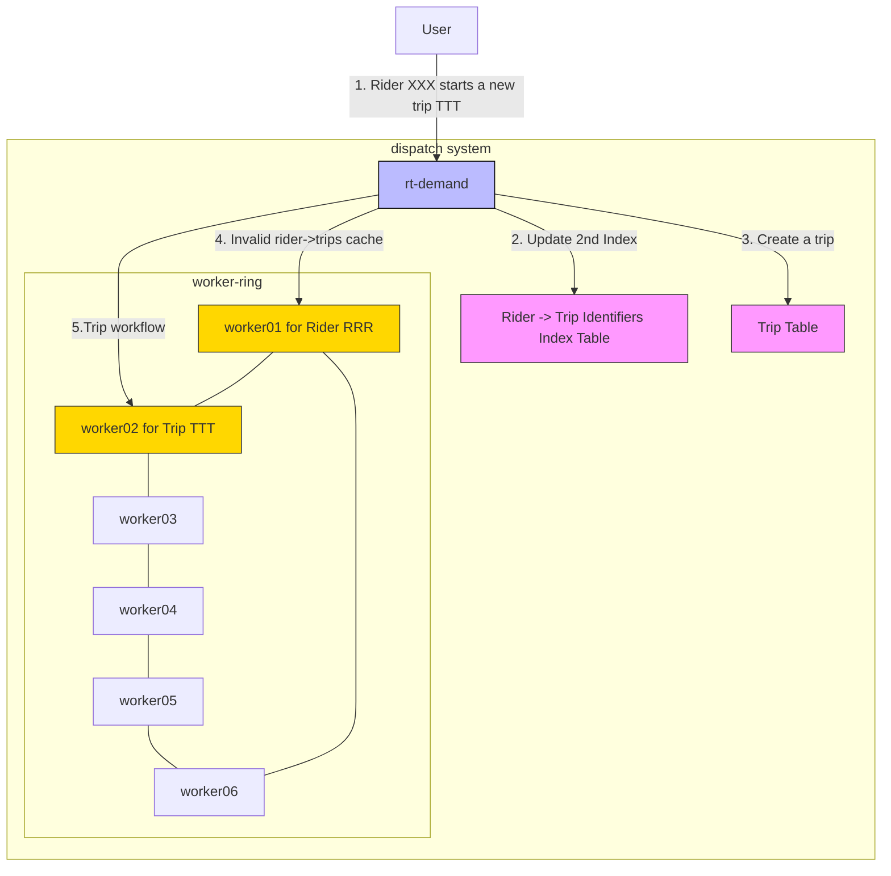

```mermaid
graph TD
    User --> |1. Rider XXX starts a new trip TTT| rtd[rt-demand]
    rtd --> |2. Update 2nd Index| indexTable[Rider -> Trip Identifiers Index Table]
    rtd --> |3. Create a trip | tripTable[Trip Table]
    rtd --> |4. Invalid rider->trips cache| worker01[worker01 for Rider RRR]    
    rtd --> |5.Trip workflow| worker02[worker02 for Trip TTT]
    worker03
    worker04
    worker05
    worker06

    
    subgraph worker-ring
        worker01 --- worker02
        worker02 --- worker03        
        worker03 --- worker04
        worker04 --- worker05
        worker05 --- worker06
        worker06 --- worker01           
    end

    subgraph dispatch system
        rtd
        worker-ring
        indexTable
        tripTable
    end

    style rtd fill:#BBF,stroke:#000,stroke-width:1px
    style indexTable fill:#F9F,stroke:#333,stroke-width:1px
    style tripTable fill:#F9F,stroke:#333,stroke-width:1px
    style worker01 fill:#FFD700,stroke:#333,stroke-width:1px
    style worker02 fill:#FFD700,stroke:#333,stroke-width:1px

```
