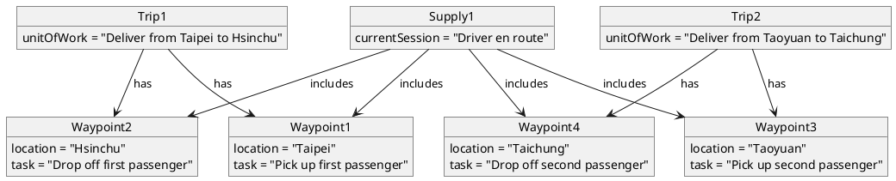

```plantuml
@startuml
object Trip1 {
  unitOfWork = "Deliver from Taipei to Hsinchu"
}

object Trip2 {
  unitOfWork = "Deliver from Taoyuan to Taichung"
}

object Waypoint1 {
  location = "Taipei"
  task = "Pick up first passenger"
}

object Waypoint2 {
  location = "Hsinchu"
  task = "Drop off first passenger"
}

object Waypoint3 {
  location = "Taoyuan"
  task = "Pick up second passenger"
}

object Waypoint4 {
  location = "Taichung"
  task = "Drop off second passenger"
}

object Supply1 {
  currentSession = "Driver en route"
}

Trip1 --> Waypoint1 : has
Trip1 --> Waypoint2 : has
Trip2 --> Waypoint3 : has
Trip2 --> Waypoint4 : has

Supply1 --> Waypoint1 : includes
Supply1 --> Waypoint2 : includes
Supply1 --> Waypoint3 : includes
Supply1 --> Waypoint4 : includes

@enduml

```
